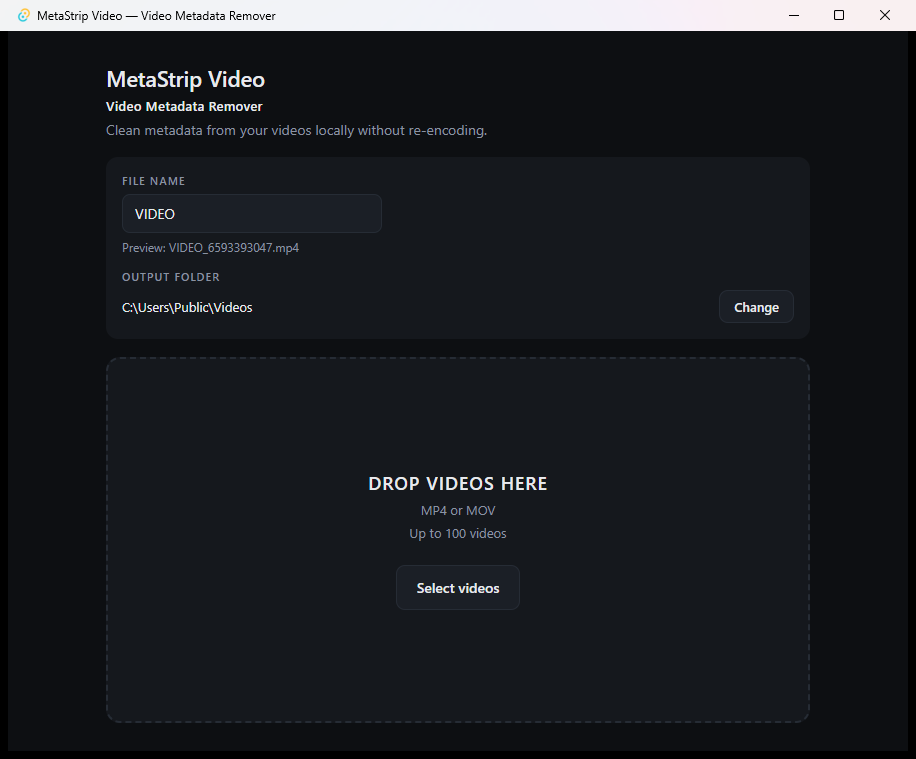

# MetaStrip Video — Video Metadata Remover

> Fast, offline video metadata remover for Windows.
> Strip metadata, chapters and data tracks from MP4 and MOV files without re-encoding.

[](LICENSE)
[](#download)
[](https://tauri.app)
[](https://www.rust-lang.org)
[](THIRD-PARTY-NOTICES.md)



Drop up to 100 videos, press one button, get clean copies. Your originals are never
touched, the picture and sound are copied across untouched, and nothing leaves your
computer.

## Why MetaStrip?

Every video you export carries more than picture and sound. A phone stamps in the
camera model and the time. An editor leaves its name. A GoPro writes a whole GPS
telemetry track. Publish the file and you publish all of it.

Most tools that strip this re-encode the video to do it, which costs quality and
minutes per file. MetaStrip copies the media streams across bit for bit and rebuilds
the container without the metadata, so a clean copy takes about as long as a file copy
and looks exactly like the original.

- **Small.** One window, one button. No project files, no timeline, no settings page.
- **Local.** Videos are processed on your machine and never uploaded.
- **Transparent.** The exact FFmpeg command is [in this README](#how-it-works), and the
  source is here to read.

## Features

- Batch up to **100 videos** at a time
- **MP4 and MOV**
- Removes global metadata, per-stream metadata, chapters and data tracks
- **No video re-encoding**, no audio re-encoding
- Original files are never modified or deleted
- Automatic unique output names, so nothing overwrites anything
- Output folder and file-name prefix are remembered between runs
- Atomic writes: a crash can never leave a half-written file under a finished name
- Works offline; **FFmpeg is bundled**, nothing to install separately
- **Signed automatic updates** through GitHub Releases
- Single Windows installer

## Download

**[Download MetaStrip Video for Windows](https://github.com/emilioperna/metastrip-video/releases/latest)**

Grab the `x64-setup.exe` from the latest release and run it. That installer is the only
thing you need: **FFmpeg is bundled**, so there is nothing else to install and nothing to
configure.

- **Windows x86_64**
- Published on **GitHub Releases**, and **signed** — the app verifies the signature of
  every update it installs
- Updates itself from then on

Prefer to build it yourself? See [Building from source](#building-from-source).

## How to use

1. Install MetaStrip Video.
2. Choose an output folder, and a file-name prefix if you want one.
3. Drop your videos onto the window, or press **Select videos**.
4. Press **Clean**.
5. The cleaned copies are in the folder you chose.

Every output is named `PREFIX_##########.mp4`, where the ten digits are a random ID
that is never reused — for example `VIDEO_0917283645.mp4`. The originals keep their
own names, in their own folder, unchanged.

## What gets removed?

| Removed | Examples |
| --- | --- |
| Global metadata | title, artist, album, comment, copyright, description, creation time, encoder |
| Location tags | `location`, `com.apple.quicktime.location.ISO6709` |
| Device tags | `com.apple.quicktime.make`, `.model`, `.software` |
| Per-stream metadata | track titles, handler names, stream language |
| Chapters | chapter names and the text track carrying them |
| Data tracks | GoPro `gpmd` telemetry, iPhone `mebx`, other timed-metadata streams |

Data tracks are worth calling out: stripping the tags around such a track leaves the
track itself, payload and all. MetaStrip drops the tracks too.

## What stays untouched?

- **The video bitstream.** Copied, not re-encoded — byte-identical to the source.
- **The audio bitstream.** Same.
- **Your original files.** Never modified, never deleted, never moved.
- **Picture quality.** There is no quality setting because nothing is re-compressed.

The container itself is rewritten by FFmpeg, so the output file is not a byte-for-byte
copy of the input — the media inside it is.

## Private by design

Video processing is entirely local. Your files are read from your disk, handed to a
bundled FFmpeg on your machine, and written back to a folder you chose.

- No upload, no cloud processing, no server
- No account, no sign-in
- No analytics, no telemetry, no crash reporting
- No database

The **only** network request the app makes is the signed update check against GitHub
Releases, described below. If you block it, everything else keeps working.

## Automatic updates

MetaStrip checks GitHub Releases for a newer version at startup, and once an hour
after that. A newer version downloads in the background and installs itself.

Updates are signed. The app carries the matching public key and refuses anything whose
signature does not verify, so a tampered or unsigned installer is never run.

An update never interrupts your work: if a batch is being processed the download still
happens, but the installer waits until the last video is done. If GitHub cannot be
reached, the check is skipped silently.

Your settings survive updates — the prefix, output folder and used-ID registry live in
`%APPDATA%\com.metastrip.video\` and no install touches them.

## Supported formats

| | |
| --- | --- |
| Input | MP4, MOV |
| Output | Same container as the input |
| Platform | Windows 10/11, x86_64 |

## How it works

Per file, the app runs the bundled FFmpeg once:

```
ffmpeg -n -i INPUT \
  -map 0 -c copy \
  -map_metadata -1 -map_metadata:s -1 -map_chapters -1 \
  -dn \
  -fflags +bitexact \
  -movflags +faststart \
  OUTPUT
```

- `-c copy` copies the encoded streams instead of re-encoding them. This is why the
  media is bit-identical, and why cleaning is typically much faster than transcoding.
- `-map_metadata -1 -map_metadata:s -1 -map_chapters -1` drop file-level metadata,
  per-stream metadata and chapters.
- `-dn` drops data tracks. `-map 0` would otherwise copy them, and a data track is
  metadata in its own right.
- `-fflags +bitexact` keeps FFmpeg from stamping its own version into the output.
- `-movflags +faststart` moves the index to the front so the file starts playing
  immediately when streamed. If a container rejects it, the file is retried once
  without it rather than failing.

FFmpeg writes to a temporary name, and the file is renamed into place only after it
exits successfully. An interrupted run can therefore leave a leftover temporary file,
but never a truncated video under a finished name. Leftovers are swept at the start of
the next batch.

More detail — the FFmpeg sidecar, the ID registry, stored state — is in
[docs/DEVELOPMENT.md](docs/DEVELOPMENT.md).

## Limitations

- **Windows x86_64 only** today. The bundled FFmpeg is a Windows binary.
- **MP4 and MOV only.**
- MetaStrip removes what the pipeline above removes. It is **not a forensic
  anonymisation tool**, and makes no claim that a cleaned file is unidentifiable:
  encoder characteristics, frame content and the container structure all remain.
- The output container is rewritten, so the file is not byte-identical to the input.

## Roadmap

Nothing is promised, but these are the realistic next steps:

- More container formats
- An evaluation of macOS and Linux builds, which need their own FFmpeg sidecar

## Building from source

```
git clone https://github.com/emilioperna/metastrip-video.git
cd metastrip-video
npm install
npm run setup:ffmpeg
npm run tauri dev
```

You need Node.js, npm and a Rust toolchain (MSVC, x86_64). `npm run setup:ffmpeg`
fetches the pinned FFmpeg binary that gets bundled into the app; it is not stored in
git. To build the installer:

```
npm run tauri build
```

See [docs/DEVELOPMENT.md](docs/DEVELOPMENT.md) for the architecture, and
[docs/RELEASING.md](docs/RELEASING.md) for how a release is cut.

## Contributing

Bug reports, ideas and pull requests are welcome. Start with
[CONTRIBUTING.md](CONTRIBUTING.md) — it covers the local setup, the tests, and the one
rule worth knowing up front: the FFmpeg pipeline does not change without a very good
reason.

Please do not attach private videos to a public issue.

## Security

Update signing is the security-sensitive part of this project. To report a
vulnerability, see [SECURITY.md](SECURITY.md) — please do not open a public issue for
one.

## FAQ

**Is it free?** Yes, and open source under the MIT License.

**Does it upload my videos?** No. Processing is local; the only network request is the
update check.

**Does it reduce quality?** No. Video and audio are copied, not re-encoded.

**Does it overwrite my originals?** No. Originals are never modified or deleted.

**Do I need FFmpeg installed?** No, it is bundled with the app.

**Which formats?** MP4 and MOV.

**Does it update itself?** Yes, through signed updates from GitHub Releases.

## License

MetaStrip Video is open source under the [MIT License](LICENSE).

The bundled FFmpeg is licensed separately, under the LGPL v3+, and is redistributed
unmodified. See [THIRD-PARTY-NOTICES.md](THIRD-PARTY-NOTICES.md) for versions,
checksums, source links and the reasoning; the FFmpeg licence text is also installed
alongside the application as `FFMPEG-LICENSE.txt`.
